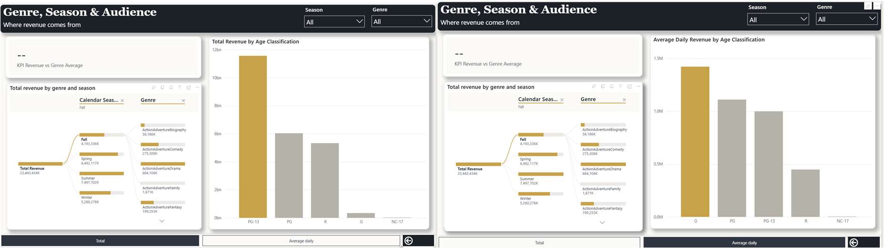
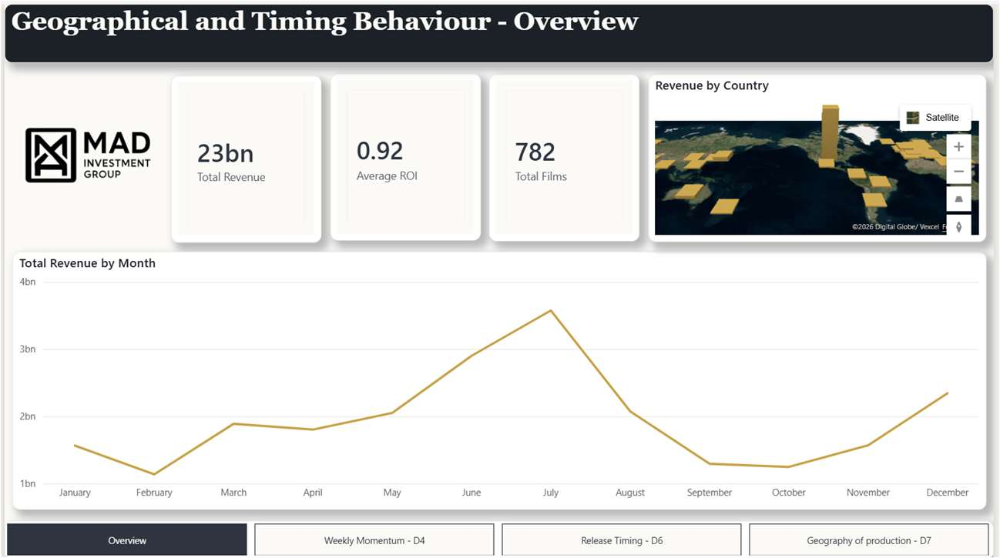
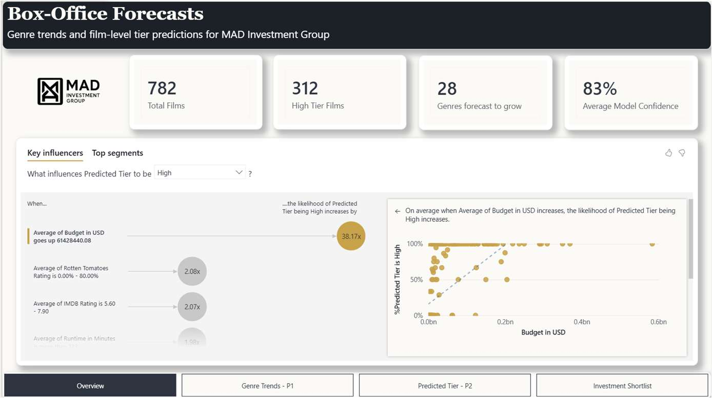
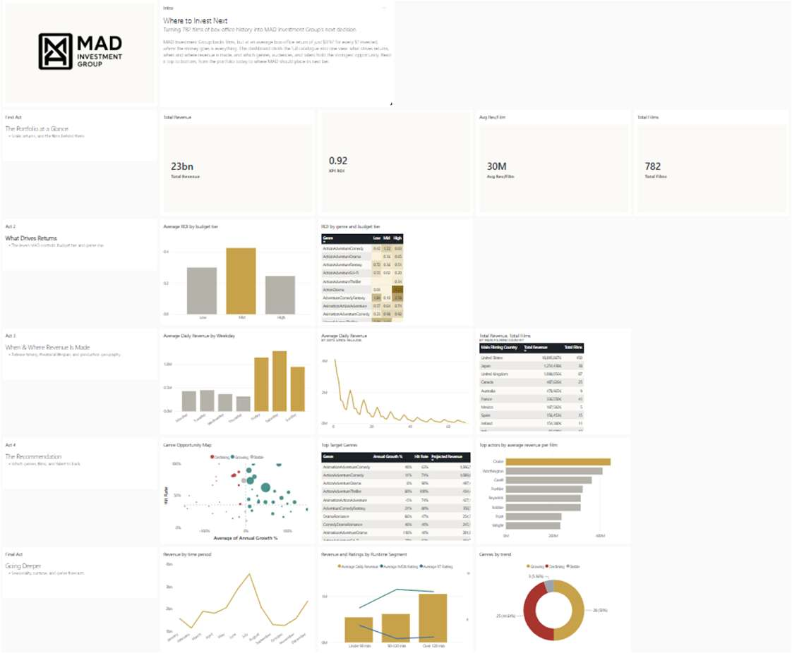

# Movie Venture — BI-Powered Cinematic Intelligence


## Project Overview

End-to-end Business Intelligence solution for **film investment decision-making**, built on **Microsoft Fabric**. The project ingests daily box-office data from Box Office Mojo, enriches it through multi-API pipelines (TMDb, OMDb, Wikidata), models it into a Kimball-compliant star schema, and delivers predictive analytics — all within a single cloud-native platform.

**782 films | 34,568 daily records | 5 dimensions | 13 business questions | 2 predictive models**

> **Academic Context:** Business Intelligence I & II, MSc Information Management (Business Intelligence) — Nova IMS, Universidade Nova de Lisboa (2025/2026)

---

## Architecture

```
                         TMDb API ─┐
                         OMDb API ──┤── Python Enrichment (5 notebooks)
                      Wikidata API ─┘           │
                                                ▼
                                    ┌───────────────────────┐
                                    │  Fabric Lakehouse     │
                                    │  LH_SOURCES_MAD_MOVIES│
                                    │  (8 source CSVs)      │
                                    └───────────┬───────────┘
                                                │
                              Dataflows Gen2 (6 transforms)
                                                │
                                                ▼
                                    ┌───────────────────────┐
                                    │  Staging Warehouse    │
                                    │  STG_MAD_MOVIES       │
                                    │  (6 tables + DQ log)  │
                                    └───────────┬───────────┘
                                                │
                              17 Validation Rules (automated)
                                                │
                                                ▼
                                    ┌───────────────────────┐
                                    │  Data Warehouse       │
                                    │  DW_MAD_MOVIES        │
                                    │  (Star Schema)        │
                                    └──────┬────────┬───────┘
                                           │        │
                                           ▼        ▼
                                    ┌──────────┐ ┌──────────────┐
                                    │ Semantic │ │ ML Notebook  │
                                    │ Model    │ │ (PySpark)    │
                                    │ SM MAD   │ │ Genre Trends │
                                    │ Movies   │ │ Film Tiers   │
                                    └────┬─────┘ └──────────────┘
                                         │
                                         ▼
                                    ┌──────────┐
                                    │ Power BI │
                                    │ Dashboard│
                                    │ (soon)   │
                                    └──────────┘
```

For detailed architecture documentation, see [`docs/ARCHITECTURE.md`](docs/ARCHITECTURE.md).

---

## Star Schema

```
    ┌──────────────┐     ┌───────────────────┐     ┌──────────────┐
    │  dim_actor   │     │  dim_prod_company  │     │ dim_director │
    │──────────────│     │───────────────────│     │──────────────│
    │ sk_actor (PK)│     │ sk_prod_co (PK)   │     │ sk_dir (PK)  │
    │ name, nation-│     │ company, country,  │     │ name, nation-│
    │ ality, age   │     │ continent, city    │     │ ality, age   │
    └──────┬───────┘     └────────┬──────────┘     └──────┬───────┘
           │                      │                        │
           └──────────┬───────────┴────────────┬───────────┘
                      │                        │
                      ▼                        │
              ┌───────────────────┐            │
              │ fact_daily_box    │            │
              │ _office           │            │
              │───────────────────│            │
              │ fk_date           │◄───────────┤
              │ fk_film           │            │
              │ fk_actor          │     ┌──────┴───────┐
              │ fk_director       │     │  dim_date    │
              │ fk_prod_company   │     │──────────────│
              │ gross_revenue/day │     │ sk_date (PK) │
              │ days_since_release│     │ weekday, type│
              └───────┬───────────┘     │ season, month│
                      │                 │ holiday, mkt │
               ┌──────┴───────┐        │ season       │
               │  dim_film    │        └──────────────┘
               │──────────────│
               │ sk_film (PK) │
               │ title, genre │
               │ budget, IMDb │
               │ RT, awards   │
               │ runtime, lang│
               │ country      │
               └──────────────┘

    Grain: One record per Film x Date
```

---

## Business Questions

### Analytical (BI 1 & 2)

| # | Business Question |
|---|------------------|
| BQ1 | Which actors appear in the highest-grossing films? |
| BQ2 | How do award-winning films differ from non-awarded in revenue, ratings, and genre? |
| BQ3 | How does performance differ across runtime segments (<90, 90-120, >120 min)? |
| BQ4 | Which genres experience the largest average weekly revenue change? |
| BQ5 | How do films perform across filming countries and production company countries? |
| BQ6 | What is the average revenue, runtime, and ratings per director? |
| BQ7 | Which genres generate highest revenue, and how do they differ in ratings/runtime/seasons? |
| BQ8 | How does revenue differ across IMDb and Rotten Tomatoes rating brackets? |
| BQ9 | How do revenues vary across age classifications, seasons, and genres? |
| BQ10 | Which weekdays generate the highest average daily revenue? |
| BQ11 | Which spoken languages appear most among the top 50 highest-grossing films? |
| BQ12 | Which films rank top 5 highest-rated in high-budget vs low-budget categories? |
| BQ13 | What is the most profitable day, season, and marketing season per year? |

### Predictive (ML)

| # | Business Question | Method | Result |
|---|------------------|--------|--------|
| BQ P1 | Genre Revenue Trend Forecasting | Linear Regression (per genre) | 193 genres classified as Growing/Declining/Stable with 2025 projections |
| BQ P2 | Film Tier Classification | Random Forest vs GBM | RF wins (F1=0.719), 782 films classified into High/Mid/Low revenue tiers |

**Top predictive features:** Budget USD (0.326), Age Classification (0.113), Runtime (0.071), Award Nominations (0.070), IMDb Rating (0.049)

---

## Data Pipeline

### Master ETL Pipeline

```
PL_MAD_MOVIES_MASTER_ETL
═══════════════════════════════════════════════════════════════════

  ┌─────────────┐     ┌─────────────┐     ┌─────────────┐     ┌─────────────┐
  │ PL split    │     │ PL run STG  │     │ PL validate │     │ PL run DW   │
  │ source file │────>│ initial     │────>│ Data        │────>│ load        │
  │             │     │ (load STG)  │     │ (17 rules)  │     │ (load DW)   │
  └─────────────┘     └─────────────┘     └─────────────┘     └─────────────┘
        │                    │                   │                    │
   Split CSVs into      6 Dataflows Gen2    Automated DQ       Clear + Copy
   entity-specific      load staging        validation with    dims parallel,
   source tables        tables (Kimball)    logging to         then load fact
                                            log_quality_checks
```

### Data Quality Framework

17 automated validation rules with results logged to `log_quality_checks`:

| Rule | Check | Applied To |
|------|-------|-----------|
| 1 | Business Key integrity (no duplicates) | All dimensions |
| 2 | Attribute-level uniqueness | All dimensions |
| 3 | Fact composite PK integrity | Fact table |
| 4 | FK parent existence (no orphans) | All FK relationships |
| 5 | Gross revenue non-negative | Fact table |
| 6 | Days since release non-negative | Fact table |
| 7 | Revenue rows must have days_since_release | Fact table |

**Result: 15/17 rules passed. 2 failures investigated and documented.**

---

## Data Sources

| Source | Type | Purpose |
|--------|------|---------|
| **Box Office Mojo** | Manual collection | Daily box-office performance (revenue, rankings) |
| **TMDb API** | REST API | Film metadata, cast, crew, ratings, posters |
| **OMDb API** | REST API | IMDb/RT ratings, awards, runtime |
| **Wikidata** | SPARQL | Production company geography (city, country, continent) |

Data enrichment was performed iteratively across **5 Python notebooks**, progressively adding attributes through a multi-phase pipeline with persistent caching and fuzzy title matching (Levenshtein distance).

---

## Skills Demonstrated

- **Microsoft Fabric** — Lakehouse, Warehouse, Dataflows Gen2, Pipelines, Semantic Model
- **Data Warehouse Design** — Kimball methodology, star schema, conformed dimensions
- **ETL/ELT Pipeline Design** — Master orchestration, parallel execution, incremental loading
- **SQL** — DDL, DQL, validation queries, surrogate key generation
- **Data Quality Framework** — Automated validation rules with logging and failure investigation
- **Python** — API integration (TMDb, OMDb, Wikidata SPARQL), data enrichment, fuzzy matching
- **Machine Learning** — Classification (RF, GBM), regression, cross-validation, feature importance
- **Semantic Modeling** — DAX measures, KPIs, hierarchies (Calendar, Marketing Season, Weekday)
- **Power Query** — Dataflows Gen2 transformations, Kimball-compliant dimension modeling

---

## Tech Stack

| Category | Tools |
|----------|-------|
| **Platform** | Microsoft Fabric (Lakehouse, Warehouse, Pipelines, Dataflows Gen2) |
| **Languages** | Python 3, SQL, DAX, PySpark |
| **ML** | scikit-learn (RandomForest, GradientBoosting, LinearRegression) |
| **Data** | pandas, NumPy, requests, fuzzywuzzy |
| **APIs** | TMDb, OMDb, Wikidata SPARQL |
| **Visualization** | Power BI (coming), Matplotlib, Seaborn |
| **Semantic Layer** | Power BI Semantic Model (DAX measures, hierarchies) |

---

## Project Structure

```
movie-venture-bi/
├── README.md
├── requirements.txt
├── .gitignore
├── notebooks/
│   ├── enrichment/
│   │   ├── 01_initial_enrichment.ipynb         # TMDb + OMDb: directors, actors, ratings
│   │   ├── 02_enrichment_runtime_franchise.ipynb  # Runtime, franchise detection, Wikidata
│   │   ├── 03_enrichment_caching_matching.ipynb   # Persistent caching, studio matching
│   │   ├── 04_enrichment_budget_posters.ipynb     # Budget, posters, birthdates
│   │   └── 05_enrichment_company_geo.ipynb        # Company city/continent (SPARQL)
│   └── ml/
│       └── predictive_business_questions.py       # Genre trends + Film tier prediction
├── sql/
│   ├── stg_table_creation.sql                     # Staging area DDL
│   ├── dw_table_creation.sql                      # Data Warehouse DDL
│   └── validation_rules.sql                       # 17 DQ validation rules
├── docs/
│   └── ARCHITECTURE.md                            # Detailed architecture documentation
├── report/
│   └── BI II Final_Group 181.pdf                  # Full academic report (50 pages) covering BI I & BI II
└── assets/                                        # Architecture & Dashboard screenshots
```

---

## How to Run

The data enrichment notebooks can be run locally:

```bash
git clone https://github.com/diogovasconcelosmerca/movie-venture-bi.git
cd movie-venture-bi
pip install -r requirements.txt
jupyter notebook notebooks/enrichment/01_initial_enrichment.ipynb
```

The ETL pipelines, Data Warehouse, Semantic Model, and ML notebook run on **Microsoft Fabric** and require access to the workspace.

---

## Report

The full academic report covering both engineering (BI I) and analysis/dashboarding (BI II) with detailed methodology, architecture decisions, predictive modelling, and data visualization is available at [`report/BI II Final_Group 181.pdf`](report/BI%20II%20Final_Group%20181.pdf).

---

## Semantic Model (BI II)

The analytical layer is built with a **Direct Lake** semantic model over the Data Warehouse, translating technical tables into a business-ready format.
- **Hierarchies**: 6 drill-down paths across Date (Calendar, Marketing Season, Weekday), Actor, Director, and Production Company.
- **DAX Measures**: 8 Base Measures (Total Revenue, Avg Revenue per Film, etc.), 3 Supporting Measures, 3 Advanced Measures (for weekly momentum).
- **KPIs**: 4 native KPIs comparing current performance against reference values (e.g., Genre Average, ROI, Actor Average).

---

## Predictive Analytics

Predictive models were built using scikit-learn in a Fabric PySpark notebook, reading from the DW and writing results directly as Delta tables (exposed to the semantic model).

1. **Genre Trends (Linear Regression)**: Predicts next-year revenue for 193 genres. Identifies genres as *Growing*, *Declining*, or *Stable*.
2. **Film Tier Classification (Gradient Boosting)**: Predicts box-office tier (High, Mid, Low) before a film's release based on budget, runtime, ratings, and genre. 
   - **Performance**: F1 Score = 0.737, Accuracy = 0.738.
   - **Top Feature**: Budget (51.2% importance), followed by Runtime (4.2%) and Award Nominations (4.2%).
   - The model proved that tier predictions accurately track real revenue (High ≫ Mid ≫ Low) and can guide investment decisions.

---

## Reporting & Dashboarding

The visualization layer translates engineering into decisions for the investment committee. It consists of three interactive reports, a paginated report, and a final executive dashboard:

### 1. Report A: Performance & Return
Focuses on which film, budget, and talent characteristics drive revenue. 
- *Insight*: Return is concentrated. The mid-budget tier is the most capital-efficient overall, but specific low-budget genre blends (e.g., ComedyFantasy) yield massive ROI.
 *(Placeholder for screenshot)*

### 2. Report B: Timing & Geography
Focuses on when and where revenue is generated.
- *Insight*: Takings cluster heavily on weekends, and a film's commercial life decays sharply within 70 days. Revenue concentrates in a limited set of filming countries.
 *(Placeholder for screenshot)*

### 3. Report C: Box-Office Forecasts
Predictive analytics dashboard showing future trends and a prescriptive "Where to Invest" view.
- *Insight*: Identifies the "sweet spot" of investment — growing genres with high success rates and large projected revenues (e.g., AnimationAdventureComedy).
 *(Placeholder for screenshot)*

### 4. Paginated Reports: Talent League Tables
Pixel-perfect, print-ready reports ranking Top 30 Lead Actors and Directors by cumulative box-office revenue to support casting and greenlight decisions.

### 5. Executive Dashboard: "MAD Movies"
A single-canvas dashboard pinning the decision-critical tiles from all reports, guiding the user from context to recommendation ("Where to Invest Next").
 *(Placeholder for screenshot)*

---

## The Ideal Film Profile (Findings)

Based on the full analytical lifecycle, MAD Investment Group's data-driven investment strategy concludes:
1. **Return is concentrated, not uniform.** Average ROI is $0.92 per $1. Edge comes from selection, not spending.
2. **At low budget, precision beats breadth.** Specific blends outperform broad genres.
3. **Longer films earn more.** Films >120 mins average $1.05M daily vs $567K for <90 mins.
4. **Ratings are the next lever.** After budget, critical quality (IMDb, Rotten Tomatoes) drives top-tier performance.
5. **Timing is consistent.** Weekend releases and a 70-day theatrical window are universal.
---

## Authors

**Group 81** — Business Intelligence I & II, MSc Information Management (BI)
Nova IMS — Universidade Nova de Lisboa (2025/2026)

- [Diogo Merca](https://github.com/diogovasconcelosmerca)
- [Madalina Noje](https://github.com/madalinanoje)
- Alexandre Duarte
- Matilde Cordeiro
